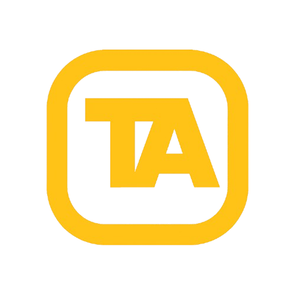

<div align="center">
  
  <br /><br />
  <p><strong>Full-Stack Developer Portfolio + Admin CMS</strong></p>
  <p>Dynamic content, secure admin workflows, and production-ready canonical architecture.</p>
  <br />

  
  
  
  
</div>

---

## What Is This Project?

This repository powers Talha Ahmad's personal website, but it is more than a static portfolio.

It combines:

1. A public-facing portfolio built with modern frontend patterns and strong SEO.
2. A private admin dashboard where all key content can be edited without changing code.
3. A strictly typed canonical MongoDB data layer managing relationships between skills, roles, events, and awards.

In short: this is a full-stack portfolio platform designed to be maintainable, scalable, and production-ready.

---

## Live Links

- Domain: https://talhaahmad.me
- Repository: https://github.com/Talhaahmad9/portfolio
- Deployment: Vercel

---

## Architecture and Rendering Model

This project is built heavily around the **Canonical Data Model** approach:

1. Every `app/**/page.tsx` remains a Server Component fetching strictly from a canonical domain.
2. Interactivity and animation live in small client islands (e.g. `SplashCursor`, `HeroTypewriter`).
3. Server Actions handle all data mutations and trigger precise `revalidatePath` updates.
4. Relational data (e.g., Projects linking to Skills, Awards linking to Events) is deeply modeled in MongoDB using ObjectIds.

### High-level structure

```text
portfolio/
├── actions/             # Server actions for mutations
├── app/                 # Next.js App Router
│   ├── admin/           # Secured CMS Dashboard
│   ├── layout.tsx       # Root layout & providers
│   ├── page.tsx         # Public Homepage
├── components/          # Reusable UI elements
│   ├── admin/           # Admin-specific forms and data tables
│   ├── ...              # Public components by feature area
├── lib/                 # Core logic
│   ├── admin/           # Admin queries and authorization
│   ├── db/              # Mongoose models (Canonical Architecture)
│   ├── public/          # Public-facing data adapters (read-only)
│   ├── typography.ts    # Design system typography tokens
│   └── r2.ts            # Cloudflare R2 bucket interactions
└── public/              # Static assets
```

---

## Database Model (Canonical CMS)

The platform relies on the following MongoDB collections:

1. `users`: Auth credentials for admin access.
2. `sitesettings`: A strict singleton configuration for identity, hero, SEO, and layout.
3. `projects`: V2 Canonical model for case studies, featuring arrays for skills and roles.
4. `roles`: Professional, leadership, and community roles.
5. `educations`: Academic history and degree programs.
6. `skills`: Technical skill taxonomy (frameworks, tools).
7. `events`: Hackathons, competitions, and conferences.
8. `awards`: Honors and competition placements (linking to events/projects).
9. `certifications`: Verified credentials and certificates.
10. `resumes`: PDF resume management and active version control.

### Design Principles

- **No Data Duplication:** Instead of inline skills string arrays, models use relational `skillIds` pointing to the canonical `Skill` model.
- **Strict Publication Status:** All entities have a `publicationStatus` (`draft`, `published`, `archived`) allowing safe staging of content.
- **Data Validation:** Zod validates every incoming request, ensuring only clean and strictly-typed data enters the database.

---

## Media Pipeline (Cloudflare R2)

For project thumbnails, banners, and CV PDFs:

1. Admin selects a file in the UI.
2. Client submits `FormData` to a Server Action.
3. Server Action verifies auth, parses the payload, and streams it to Cloudflare R2 via AWS SDK.
4. Public R2 URL is returned and persisted directly onto the relevant MongoDB document (`thumbnailUrl`, `mediaUrl`, etc).
5. Next.js cache is revalidated.

*Note: Legacy `MediaAsset` model tracking was deprecated in favor of storing URLs directly on canonical records to simplify the data lifecycle.*

---

## Environment Variables

Create `.env.local` in root:

```bash
# NextAuth
AUTH_SECRET=

# MongoDB
MONGODB_URI=

# Cloudflare R2
CLOUDFLARE_R2_ACCOUNT_ID=
CLOUDFLARE_R2_ACCESS_KEY_ID=
CLOUDFLARE_R2_SECRET_ACCESS_KEY=
CLOUDFLARE_R2_BUCKET_NAME=
NEXT_PUBLIC_R2_PUBLIC_URL=

# App
NEXT_PUBLIC_APP_URL=https://talhaahmad.me

# Optional seed overrides
ADMIN_EMAIL=
ADMIN_PASSWORD=
```

---

## Local Development

```bash
# Install dependencies
npm install

# Start development server
npm run dev
```

Open http://localhost:3000

### Seed Admin User

```bash
npm run seed
```

---

## Available Scripts

| Script | Purpose |
|---|---|
| `npm run dev` | Start development server |
| `npm run build` | Build production app |
| `npm run start` | Start production server |
| `npm run lint` | Run ESLint |
| `npm run seed` | Seed default admin user |

---

## Security Notes

1. Dashboard routes are deeply protected through Next.js middleware and `requireAdmin` server-side helpers.
2. All mutating actions verify session and database-level permissions first.
3. Zod validation completely rejects malformed payloads and handles sanitization.
4. Storage credentials and database URIs remain strictly server-only.

---

<div align="center">
  Built and maintained by <strong>Talha Ahmad</strong>.
</div>
